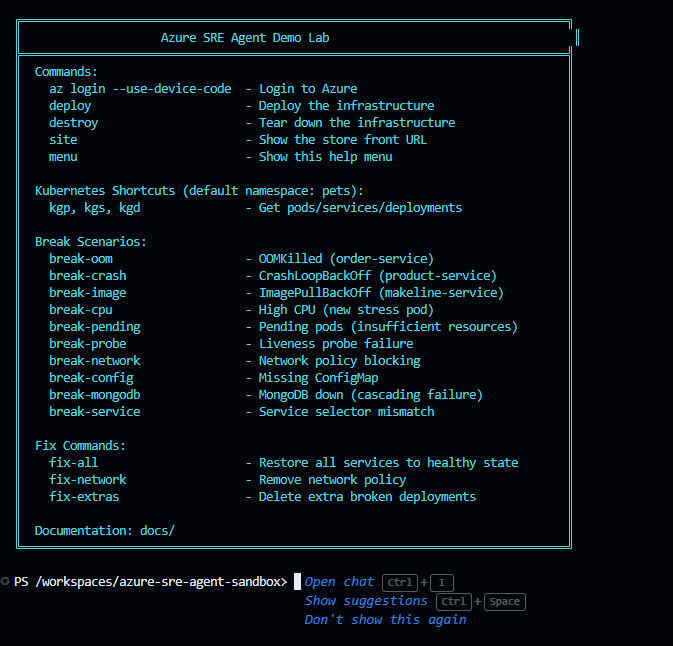

# Azure SRE Agent AmeriGas Propane Demo Lab 🔥

A fully automated Azure environment for demonstrating **Azure SRE Agent** capabilities using an **AmeriGas Propane Distribution Platform**. Deploy a breakable multi-service propane distribution application on AKS and let SRE Agent diagnose and fix the issues!

## 🎯 What This Lab Provides

- **Azure Kubernetes Service (AKS)** with a multi-pod propane distribution platform
- **10 breakable scenarios** for demonstrating SRE Agent diagnosis
- **Azure SRE Agent** deployed automatically via Bicep for AI-powered diagnostics
- **Full observability stack**: Log Analytics, Application Insights, Managed Grafana
- **Ready-to-use scripts** for deployment and teardown
- **Mission Control dashboard** with built-in GitHub Copilot SDK AI assistant
- **Dev container** for consistent development experience

## 🔥 AmeriGas Propane Architecture

The platform simulates a retail propane distributor with propane distribution and customer services:

| Service | Role | Technology |
|---------|------|------------|
| **customer-portal** | Customer portal (account, deliveries, tank levels) | Vue.js |
| **dispatch-console** | Operations console for fleet & orders | Vue.js |
| **tank-monitor** | IoT tank level monitoring & refill alerts | Node.js |
| **inventory-service** | Propane inventory, pricing, product catalog | Rust |
| **order-service** | Order fulfillment & processing | Go |
| **usage-simulator** | Customer propane usage pattern generator | Python |
| **rabbitmq** | Event bus (tank alerts, delivery orders, fulfillment updates) | RabbitMQ |
| **mongodb** | Tank readings, delivery records, customer data | MongoDB |

## 🚀 Quick Start

### Prerequisites

- Azure subscription with Owner/Contributor access
- Azure region supporting SRE Agent: `East US 2`, `Sweden Central`, or `Australia East`
- [Azure CLI](https://docs.microsoft.com/cli/azure/install-azure-cli) installed
- [VS Code](https://code.visualstudio.com/) with [Dev Containers extension](https://marketplace.visualstudio.com/items?itemName=ms-vscode-remote.remote-containers) (optional but recommended)



### Deploy

```powershell
# 1. Login to Azure
az login --use-device-code

# 2. Deploy infrastructure (~15-25 minutes)
.\scripts\deploy.ps1 -Location eastus2 -Yes
```

> 💡 **Tip**: Type `menu` in the terminal to see all available commands including break scenarios, fix commands, and kubectl shortcuts.

## 💥 Breaking Things (The Fun Part!)

Once deployed, you can break the application using shortcut commands:

```bash
# Tank monitor memory exhaustion during winter peak
break-oom

# Inventory service crash — invalid pricing config
break-crash

# Order service deployment failure — bad image release
break-image

# See all scenarios
menu
```

To restore:
```bash
fix-all
```

## 🤖 AI-Powered Diagnostics

This lab includes **two AI assistants** for diagnosing and remediating issues:

### Mission Control Copilot (Local)

The Mission Control dashboard (`tools/mission-control/`) includes a built-in **GitHub Copilot SDK** AI assistant that can directly interact with your cluster:

1. **Launch Mission Control** — type `mission-control` in the dev container terminal
2. **Open the chat panel** — click the Copilot button or the top banner
3. **Ask it anything** — the assistant has 19 tools for kubectl, scenarios, and infrastructure operations
4. **Example prompts**:
   - "What's the health of the cluster?"
   - "Break the OOM scenario and then diagnose it"
   - "Deploy the full infrastructure to eastus2"

> **Requires**: A GitHub Copilot license. See [Mission Control Copilot](#-mission-control-copilot) for details.

### Azure SRE Agent (Cloud)

After deployment:

1. **Open the SRE Agent Portal** — visit [aka.ms/sreagent/portal](https://aka.ms/sreagent/portal)
2. **Connect it to your resources** (AKS, Log Analytics)
3. **Ask it to diagnose**:
   - "Why are pods crashing in the propane namespace?"
   - "Tank level data isn't being processed — what's wrong?"
   - "What's causing high CPU on the demand forecast pods?"

See [docs/SRE-AGENT-SETUP.md](docs/SRE-AGENT-SETUP.md) for detailed instructions, or [docs/PROMPTS-GUIDE.md](docs/PROMPTS-GUIDE.md) for a full catalog of prompts to try.

## 💰 Cost Estimate

| Configuration | Daily Cost | Monthly Cost |
|--------------|------------|--------------|
| Default deployment | ~$22-28 | ~$650-850 |
| + SRE Agent | ~$32-38 | ~$950-1,150 |

See [docs/COSTS.md](docs/COSTS.md) for detailed breakdown and optimization tips.

## 🔧 Available Scenarios

| Scenario | AmeriGas Narrative | SRE Agent Diagnoses |
|----------|-------------------|---------------------|
| OOMKilled | Tank monitor overwhelmed by winter peak readings | Memory exhaustion, limit recommendations |
| CrashLoop | Inventory service crashes — invalid pricing config | Exit codes, log analysis |
| ImagePullBackOff | Order service fails after botched image release | Registry/image troubleshooting |
| HighCPU | Demand forecast overload during peak heating season | Performance analysis |
| PendingPods | Fleet telemetry monitor pods can't schedule | Scheduling analysis |
| ProbeFailure | Safety compliance monitor misconfigured after maintenance | Probe configuration |
| NetworkBlock | Tank monitor isolated after security policy update | Connectivity analysis |
| MissingConfig | Delivery zone configuration missing after promotion | Configuration troubleshooting |
| MongoDBDown | Tank database offline — cascading order failure | Dependency tracing, root cause |
| ServiceMismatch | Tank monitor service failure after "v2 upgrade" | Endpoint/selector analysis |

## 🖥️ Mission Control Copilot

Mission Control is a local Node.js/Express dashboard powered by the **GitHub Copilot SDK** (`@github/copilot-sdk`). It provides a chat-based AI assistant with deep access to your AKS cluster.

### Prerequisites

- **GitHub Copilot license** (Individual, Business, or Enterprise)
- **GitHub Copilot VS Code extension** installed (included in the dev container)
- `kubectl` configured with AKS credentials
- `az` CLI authenticated

### Starting Mission Control

```bash
# From the dev container terminal
mission-control

# Or manually
cd tools/mission-control && npm install && npm start
```

The dashboard opens at **http://localhost:3000**.

### Copilot Agent Tools

The AI assistant has access to 19 tools organized by category:

| Category | Tools | Description |
|----------|-------|-------------|
| **Diagnostics** | `get_pods`, `get_pod_logs`, `describe_pod`, `get_events`, `get_deployments`, `get_services`, `get_nodes`, `get_cluster_health` | Inspect cluster state, pods, logs, events, and services |
| **Remediation** | `fix_all`, `fix_network`, `fix_extras`, `scale_deployment`, `restart_deployment` | Restore healthy state, remove rogue resources, scale/restart |
| **Scenarios** | `apply_break_scenario` | Apply any of the 10 breakable failure scenarios |
| **Infrastructure** | `deploy_infrastructure`, `destroy_infrastructure`, `validate_deployment`, `get_cluster_info` | Deploy/destroy Azure resources, validate health |
| **Raw Access** | `kubectl_raw` | Run arbitrary kubectl commands |

### Chat API

| Endpoint | Method | Description |
|----------|--------|-------------|
| `/api/copilot/status` | GET | Check Copilot SDK connection status |
| `/api/chat` | POST | Send a message (`{ "message": "..." }`) |
| `/api/chat/history` | GET | Retrieve conversation history |
| `/api/chat/reset` | POST | Reset conversation and create a new session |

### Features

- **Proactive status banner** — shows Copilot Ready/Connecting/Error state at the top of the dashboard
- **Failure diagnosis banner** — auto-appears after deploy/validate failures with a pre-built diagnosis prompt
- **Auto-reconnect** — recreates the Copilot session automatically if it expires
- **Tool cards** — displays which tools the agent invoked during diagnosis
- **Quick prompts** — one-click prompts for common operations
- **180-second timeout** — allows time for complex multi-tool diagnosis chains

### Troubleshooting Mission Control

| Issue | Resolution |
|-------|-----------|
| "Copilot SDK failed" on startup | Ensure you have a GitHub Copilot license and the VS Code Copilot extension is installed |
| Chat returns 503 | Copilot SDK didn't initialize — check the terminal for error details |
| Tools fail with kubectl errors | Verify `kubectl` is configured: `kubectl config current-context` |
| Session expired errors | The assistant auto-reconnects; retry the message |
| Long response times | Complex queries that chain multiple tools (e.g., `get_cluster_health`) can take up to 180 seconds |

## 🛠️ Commands Reference

### Deployment Scripts (PowerShell)

> **Note**: These PowerShell scripts deploy to Azure and can be run from the dev container, locally on Windows, or on any system with PowerShell Core installed.

| Command | Description |
|---------|-------------|
| `.\scripts\deploy.ps1 -Location eastus2` | Deploy all infrastructure to Azure |
| `.\scripts\deploy.ps1 -WhatIf` | Preview what would be deployed |
| `.\scripts\validate-deployment.ps1 -ResourceGroupName <rg>` | Verify resources and app are healthy |
| `.\scripts\destroy.ps1 -ResourceGroupName <rg>` | Tear down all infrastructure |

**Deploy script parameters:**
- `-Location`: Azure region (`eastus2`, `swedencentral`, `australiaeast`) - Default: `eastus2`
- `-WorkloadName`: Resource prefix - Default: `srelab`
- `-SkipRbac`: Skip RBAC assignments if subscription policies block them
- `-WhatIf`: Preview deployment without making changes
- `-Yes`: Skip confirmation prompts (non-interactive mode)

### Kubernetes Commands (kubectl)

| Command | Description |
|---------|-------------|
| `kubectl apply -f k8s/base/application.yaml` | Deploy healthy application |
| `kubectl apply -f k8s/scenarios/<scenario>.yaml` | Apply a break scenario |
| `kubectl get pods -n propane` | Check pod status |
| `kubectl get events -n propane --sort-by='.lastTimestamp'` | View recent events |

## 📚 Documentation

- [SRE Agent Setup Guide](docs/SRE-AGENT-SETUP.md)
- [Prompts Guide](docs/PROMPTS-GUIDE.md) — prompts for both SRE Agent and Mission Control Copilot
- [Breakable Scenarios Guide](docs/BREAKABLE-SCENARIOS.md)
- [Demo Script](docs/DEMO-SCRIPT.md)
- [Cost Estimation](docs/COSTS.md)
- [Supportability Guide](docs/SUPPORTABILITY.md)

## 🤝 Contributing

Contributions welcome! Feel free to open issues or submit PRs.

## 📄 License

MIT License - see [LICENSE](LICENSE) for details.

---

**⚠️ Important Notes:**

- SRE Agent is currently in **Preview**
- Only available in **East US 2**, **Sweden Central**, and **Australia East**
- AKS cluster must **NOT** be a private cluster for SRE Agent to access
- Firewall must allow `*.azuresre.ai`